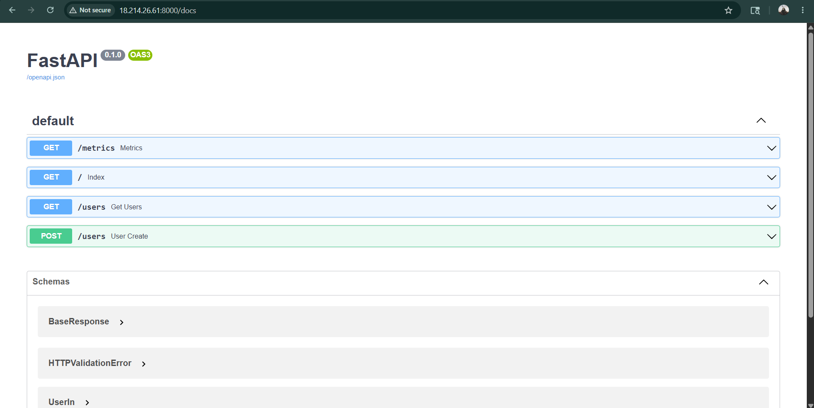
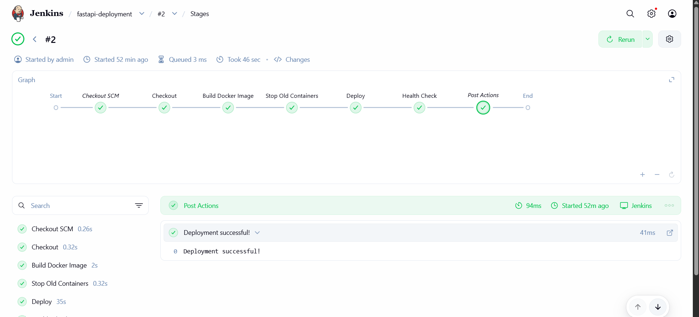
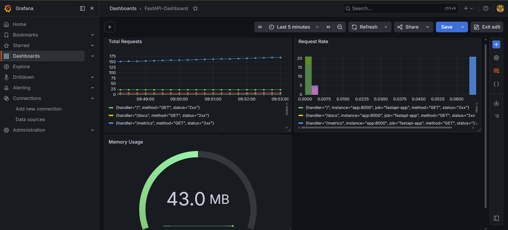
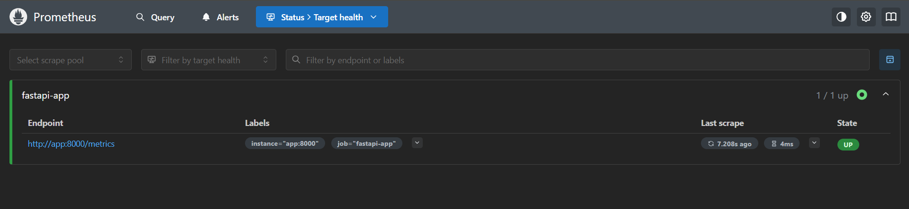
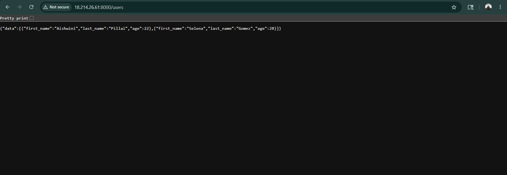

# FastAPI Docker Project

A fully containerized FastAPI application with data persistence, real-time monitoring, and an automated CI/CD pipeline deployed on AWS EC2.

---

## Tech Stack

| Tool | Purpose |
|---|---|
| FastAPI + Uvicorn | Python web framework & ASGI server |
| Docker & Docker Compose | Containerization & orchestration |
| Prometheus | Metrics collection |
| Grafana | Metrics visualization |
| Jenkins | CI/CD pipeline automation |
| AWS EC2 | Cloud deployment server |
| GitHub Webhooks | Auto-trigger Jenkins on push |

---

## Project Structure

```
fastapi-docker-project/
├── app/
│   ├── main.py          # API routes
│   ├── services.py      # JSON file read/write logic
│   ├── schema.py        # Pydantic models
│   └── data/            # Auto-created, stores users.json
├── monitoring/
│   └── prometheus.yml   # Prometheus scrape config
├── Dockerfile
├── docker-compose.yml
├── Jenkinsfile
└── requirements.txt
```

---

## API Endpoints

| Method | Endpoint | Description |
|---|---|---|
| GET | `/` | Returns hello message |
| GET | `/users` | Returns list of all users |
| POST | `/users` | Adds a new user |
| GET | `/metrics` | Prometheus metrics |
| GET | `/docs` | Swagger UI |

### Sample POST /users
```json
{
  "first_name": "Aishwini",
  "last_name": "Pillai",
  "age": 22
}
```

---

## How to Run Locally

```bash
git clone https://github.com/Aishwini08/fastapi-docker-project.git
cd fastapi-docker-project
docker-compose up -d --build
```

| Service | URL |
|---|---|
| FastAPI App | http://localhost:8000 |
| Swagger Docs | http://localhost:8000/docs |
| Prometheus | http://localhost:9090 |
| Grafana | http://localhost:3000 |

---

## Data Persistence

User data is stored in `app/data/users.json` inside the container. A **named Docker volume** is mounted at that path so data survives container restarts.

```bash
docker-compose down   # destroy containers
docker-compose up -d  # recreate containers
# GET /users → data still there ✅
```

---

## Monitoring

- **Prometheus** scrapes the `/metrics` endpoint every 15 seconds
- **Grafana** dashboard shows 3 panels:
  - Total HTTP Requests per endpoint
  - Request Rate (`rate(http_requests_total[5m])`)
  - Memory Usage (gauge)

---

## CI/CD Pipeline

Jenkins pipeline runs automatically on every GitHub push via webhook.

```
Checkout → Build Image → Stop Old Containers → Deploy → Health Check
```

Every `git push` to `main` triggers a full build and deployment on EC2 automatically.

---

## AWS Deployment

Application is deployed on an EC2 instance (Ubuntu 22.04, t2.medium).

| Service | Port |
|---|---|
| FastAPI | 8000 |
| Jenkins | 8080 |
| Prometheus | 9090 |
| Grafana | 3000 |

---

## Screenshots

### Swagger UI


### Jenkins Pipeline


### Grafana Dashboard


### Prometheus


### Data



---

## Author

**Aishwini Pillai** — [@Aishwini08](https://github.com/Aishwini08)